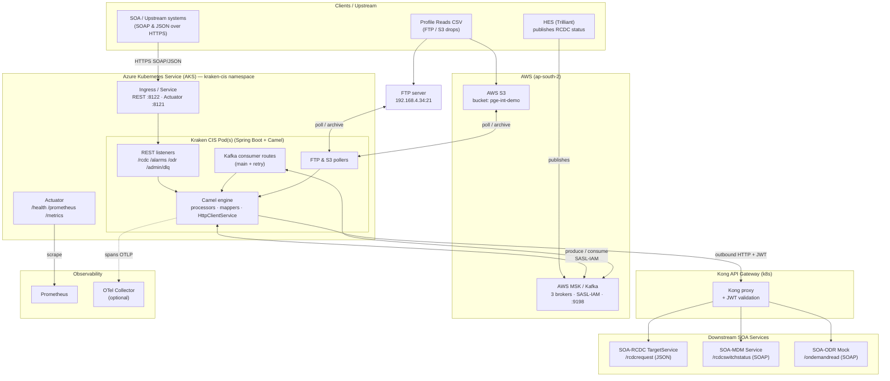
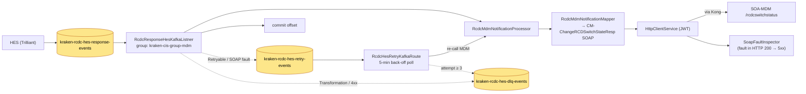
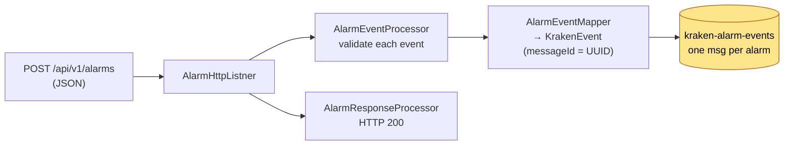
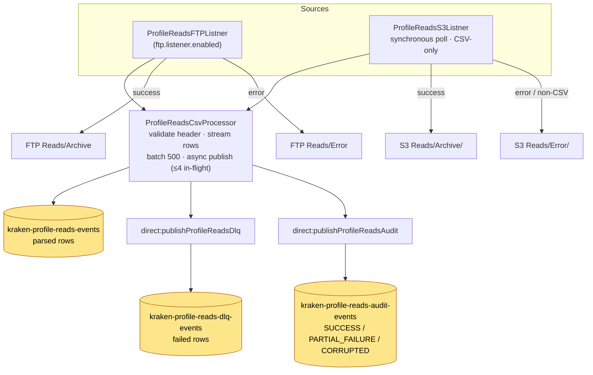

# Kraken CIS Implementation — Technical Architecture

Apache Camel / Spring Boot integration service deployed on **Azure Kubernetes Service (AKS)**,
integrating PGE's Kraken CIS with downstream SOA services and AWS messaging/storage.

- Runtime: Spring Boot 3.2.5, Apache Camel 4.6, Java 17
- Messaging: AWS MSK (Kafka, SASL/IAM, port 9198)
- Storage / file transport: AWS S3 + FTP
- Outbound gateway: Kong (JWT HS256 bearer on every call)
- Observability: Micrometer → Prometheus, OpenTelemetry tracing (traceId/spanId in MDC)

---

## 1. System Context / Deployment (AKS + external systems)



---

## 2. RCDC Request Flow (Connect / Disconnect command)

```mermaid
flowchart LR
    A["POST /api/v1/rcdc<br/>(SOAP XML)"] --> B["RcdcRequestHttpListner"]
    B --> C["SoapEnvelopeExtractor<br/>+ JAXB unmarshal"]
    C --> D["RcdcRequestProcessor<br/>validate · extract mRID/state"]
    D --> E["RcdcTargetMappingProcessor"]
    E --> P[("kraken-rcdc-events")]
    B --> ACK["Acknowledgement<br/>(SOAP 200)"]

    P --> K["RcdcRequestKafkaListner<br/>group: kraken-cis-group"]
    K --> TC["RcdcTargetCallProcessor<br/>→ SOARCDCRequestService"]
    TC --> HC["HttpClientService<br/>(3x retry, JWT)"]
    HC -->|via Kong| EXT["SOA-RCDC /rcdcrequest"]
    K --> CO["commit offset"]

    K -.->|RetryableException<br/>after 3 in-proc retries| RT[("kraken-rcdc-retry-events")]
    K -.->|Validation / 4xx| DLQ[("kraken-rcdc-dlq-events")]
    RT --> RC["RcdcRetryKafkaRoute<br/>5-min back-off poll"]
    RC -->|re-call| TC
    RC -.->|attempt &ge; 3| DLQ

    classDef topic fill:#fde68a,stroke:#b45309,color:#000;
    class P,RT,DLQ topic;
```



---

## 3. RCDC HES Response Flow (HES → MDM notification)



---

## 4. Alarms Flow



---

## 5. Profile Reads Flow (FTP & S3 CSV ingestion)



---

## 6. Retry / DLQ Mechanism (BaseKafkaConsumerRoute)

```mermaid
flowchart TB
    M["Main consumer<br/>processes message"] -->|success| OK["commit offset"]
    M -->|ValidationException<br/>TransformationException<br/>ExternalServiceException 4xx| DLQ[("DLQ topic<br/>immediate")]
    M -->|RetryableException / unknown| R3["3 in-process retries<br/>1s → 2s → 4s"]
    R3 -->|still failing| RT[("retry topic<br/>X-Error-Attempt = 1")]

    RT --> RQ["Retry consumer<br/>5-min back-off poll"]
    RQ -->|attempt &ge; max (3)| EXH["RetryQueueExhaustedException"] --> DLQ
    RQ -->|RetryableException| RT2[("retry topic<br/>attempt + 1")]
    RQ -->|any other error| DLQ
    RQ -->|success| OK2["commit offset"]

    DLQ --> MON["kraken-dlq-monitor group<br/>(never consumes)"]
    MON --> STATS["GET /api/v1/admin/dlq/stats<br/>lag → kafka.dlq.lag gauge"]

    classDef topic fill:#fde68a,stroke:#b45309,color:#000;
    class RT,RT2,DLQ topic;
```

Error context travels as Kafka **record headers** (no payload reformatting):
`X-Correlation-ID`, `X-Error-Type`, `X-Error-Message`, `X-Error-Http-Status`,
`X-Error-Attempt`, `X-Service-Name`, `X-Destination-Type`, `X-Error-Timestamp`.

---

## 7. Kafka Topics & Consumer Groups

| Topic | Producer | Consumer (group) |
|---|---|---|
| `kraken-rcdc-events` | RcdcRequestHttpListner | RcdcRequestKafkaListner (`kraken-cis-group`) |
| `kraken-rcdc-retry-events` | main consumer on failure | RcdcRetryKafkaRoute (`…-retry`) |
| `kraken-rcdc-dlq-events` | main + retry on exhaustion | `kraken-dlq-monitor` (stats only) |
| `kraken-rcdc-hes-response-events` | HES (external) | RcdcResponseHesKafkaListner (`…-mdm`) |
| `kraken-rcdc-hes-retry-events` | HES consumer on failure | RcdcHesRetryKafkaRoute (`…-hes-retry`) |
| `kraken-rcdc-hes-dlq-events` | HES main + retry | `kraken-dlq-monitor` |
| `kraken-alarm-events` | AlarmHttpListner | external |
| `kraken-profile-reads-events` | ProfileReadsCsvProcessor | external |
| `kraken-profile-reads-dlq-events` | ProfileReadsDlqRoute | `kraken-dlq-monitor` |
| `kraken-profile-reads-audit-events` | ProfileReadsAuditRoute | external |

---

## 8. Cross-Cutting Concerns

| Concern | Components |
|---|---|
| **Security** | `JwtTokenProvider` — HS256 bearer on every Kong-routed call; MSK SASL/IAM; S3 default-credentials (IAM role) |
| **Resilience** | `HttpClientService` (3× exponential retry); typed exceptions drive retry-topic vs DLQ routing |
| **Observability** | `StructuredLogger`, `RouteLoggingProcessor`, `MDCContextManager`; Micrometer → Prometheus; OpenTelemetry spans (traceId/spanId in MDC) |
| **Metrics** | `business.transaction.requests/events`, `kafka.consumed`, `kafka.dlq.published`, `kafka.retry.published`, `kafka.dlq.lag`, `http.outbound.*` |
| **Health** | `KafkaHealthIndicator` + Actuator `/health` |
| **Config** | `KafkaProducerConfig`, `ExternalServiceProperties`, `HttpClientProperties`, `ProfileReads{Ftp,S3}Properties`, `S3ClientConfig` |
```

